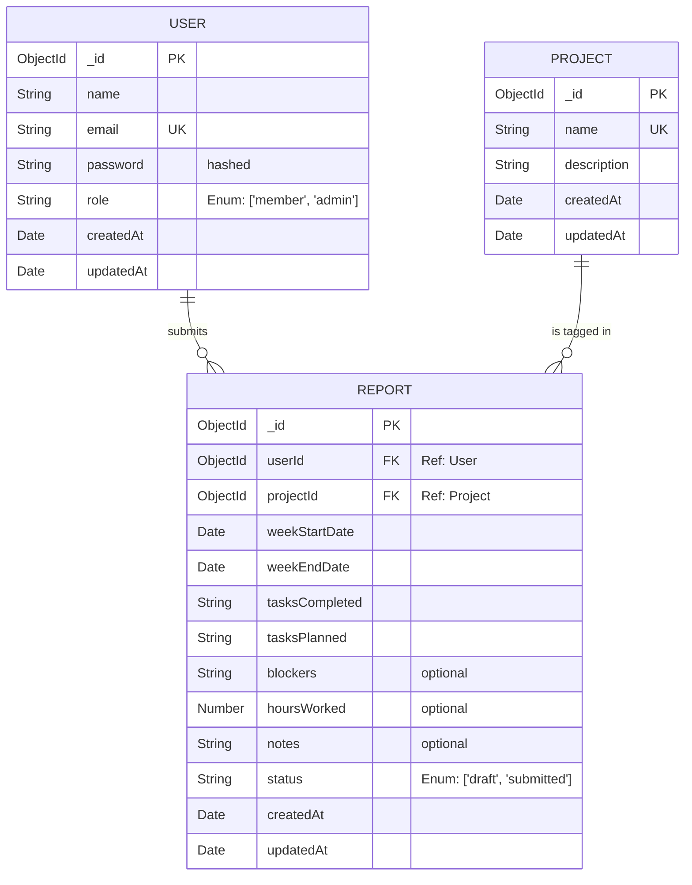

# Entity Relationship (ER) Diagram

This diagram outlines the core data models and their relationships within the MongoDB database for the Weekly Report Generator application.

### Relationship Explanations
- **USER to REPORT (1-to-Many):** A single user (team member) can create and submit multiple weekly reports over time. A report belongs exclusively to one user.
- **PROJECT to REPORT (1-to-Many):** A single project can have multiple reports associated with it (from different members or across different weeks). A report is tagged to exactly one primary project for scope clarity.
